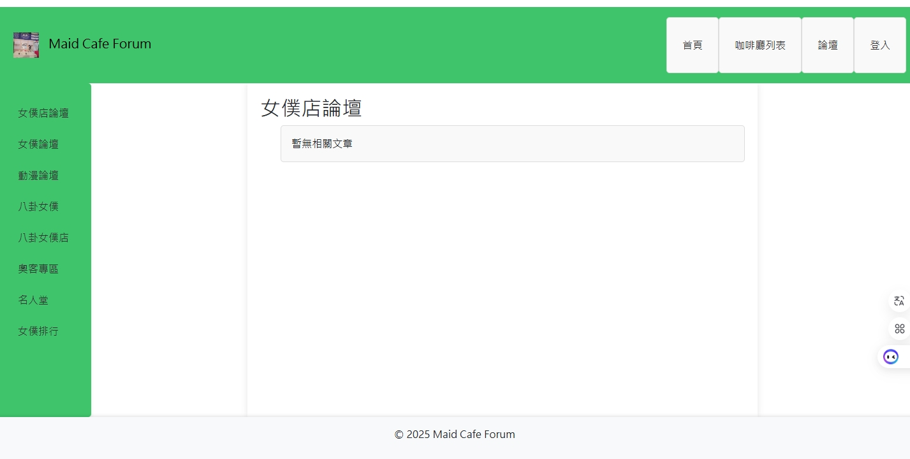

# Maid Cafe Forum

Maid Cafe Forum 是一個基於 Django 的網頁應用程式，旨在提供一個女僕咖啡廳愛好者的交流平台。用戶可以瀏覽女僕咖啡廳資訊、查看女僕詳情，並在論壇中發文、留言，討論與女僕咖啡廳相關的主題。

## 專案邏輯

### 功能結構
專案分為兩個主要應用程式：
1. **`maid_cafe` 應用**：
   - **咖啡廳資訊管理**：展示女僕咖啡廳的列表與詳細資訊，包括名稱、描述、位置和圖片，並關聯女僕資料。
   - **論壇子頁面**：提供多個主題頁面（如女僕店論壇、動漫論壇等），顯示篩選後的論壇文章。
   - **首頁**：以網格形式展示所有女僕咖啡廳，點擊可進入詳情頁。

2. **`forum` 應用**：
   - **文章管理**：用戶可以查看論壇文章列表與詳細內容，並在文章下留言。
   - **核心功能**：支援文章的標題、內容、作者、建立與更新時間，以及留言的內容與時間戳。

### URL 結構
- 根 URL (`maid_cafe_forum/urls.py`)：
  - `/`：指向 `maid_cafe` 應用的首頁。
  - `/forum/`：指向 `forum` 應用的文章列表。
- `maid_cafe` 應用：
  - `/maid-cafes/`：咖啡廳列表。
  - `/maid-cafes/<pk>/`：咖啡廳詳情。
  - `/maid-cafe-forum/` 等：各論壇子頁面。
- `forum` 應用：
  - `/forum/`：文章列表。
  - `/forum/<pk>/`：文章詳情。

### 資料模型
- **`maid_cafe/models.py`**：
  - `MaidCafe`：咖啡廳名稱、描述、位置、圖片。
  - `Maid`：女僕名稱、描述、圖片，與咖啡廳為多對一關係。
- **`forum/models.py`**：
  - `Post`：文章標題、內容、作者、建立與更新時間。
  - `Comment`：留言內容、作者、建立時間，與文章為多對一關係。

### 模板與樣式
- **`base.html`**：基礎模板，包含導航欄（使用 Bootstrap）、側邊欄和頁尾，定義了全站佈局。
- **`home.html`**：展示咖啡廳網格。
- **`maid_cafe/` 模板**：顯示咖啡廳列表與詳情，以及論壇子頁面。
- **`forum/` 模板**：顯示文章列表與詳情，並包含留言表單。
- 靜態文件（CSS、JS、圖片）存於 `static/` 目錄，自訂樣式與 Bootstrap 結合。

### 技術實現
專案採用 Django 的 MTV（模型-模板-視圖）架構：
- **模型（Model）**：使用 Django ORM 定義資料結構，與 MySQL 資料庫互動。
- **模板（Template）**：使用 Django 模板引擎，動態渲染頁面。
- **視圖（View）**：處理 HTTP 請求，查詢資料並傳遞至模板。

## 使用到的技術與工具

### 後端
- **Python 3.x**：核心程式語言。
- **Django 5.1.7**：網頁框架，提供路由、ORM、模板引擎和用戶認證。
- **MySQL**：資料庫，用於儲存咖啡廳、女僕和論壇資料，通過 Django ORM 管理。

### 前端
- **HTML/CSS/JavaScript**：基礎網頁技術。
- **Bootstrap 5.3.0**：前端框架，用於響應式設計和導航欄組件。
- **Django 模板語言**：動態生成 HTML，支援條件判斷與迴圈。

### 開發與部署工具
- **Git**：版本控制工具，用於程式碼管理。
- **GitHub**：程式碼託管平台，儲存並分享專案。
- **Docker**：包含 `Dockerfile` 和 `docker-compose.yml`，用於容器化部署。

### 依賴管理
- **`requirements.txt`**：列出 Python 套件依賴，例如 `django` 和 `mysqlclient`。

## 安裝與運行

### 前置條件
- 安裝 Python 3.x（https://www.python.org/）
- 安裝 Git（https://git-scm.com/）
- 安裝 MySQL（或使用 Docker 配置）

### 步驟
1. **克隆儲存庫**：
git clone https://github.com/your-username/maid-cafe-forum.git
cd maid-cafe-forum

2. **設置虛擬環境**（可選但推薦）：
python -m venv venv
source venv/bin/activate  # Linux/Mac
venv\Scripts\activate     # Windows

3. **安裝依賴**：
pip install -r requirements.txt

4. **配置資料庫**：
- 在 `maid_cafe_forum/settings.py` 中更新 `DATABASES` 配置，確保 MySQL 服務運行。
- 執行遷移：
python manage.py makemigrations
python manage.py migrate

5. **創建超級用戶**（可選）：
python manage.py createsuperuser

6. **運行伺服器**：
python manage.py runserver

訪問 `http://127.0.0.1:8000/` 查看網站。

## 未來改進
- 實現用戶發文功能。
- 完善論壇子頁面的篩選邏輯（例如基於標籤或分類）。
- 配置 Docker 部署，確保環境一致性。
- 添加更多前端互動功能（如 AJAX 留言）。

## 貢獻
歡迎提交問題或 Pull Request！請遵循以下步驟：
1. Fork 儲存庫。
2. 創建你的功能分支（`git checkout -b feature/your-feature`）。
3. 提交更改（`git commit -m "Add your feature"`）。
4. 推送到分支（`git push origin feature/your-feature`）。
5. 創建 Pull Request。

